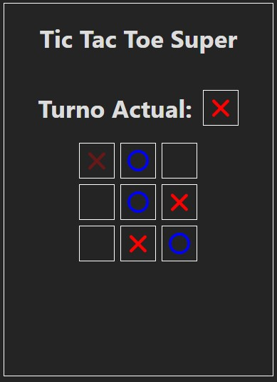
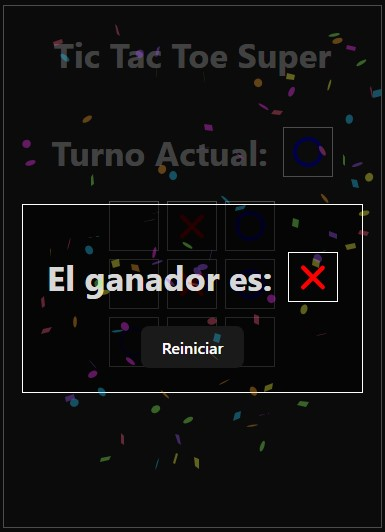

# Tic Tac Toe Modificado




## Descripción

Este proyecto es una implementación del clásico juego de Tic Tac Toe (Tres en Línea) con una interesante modificación. En esta versión, cada jugador tiene que pensar estratégicamente ya que cada tres turnos, la primera marca que hizo el jugador se elimina automáticamente. Esto introduce una nueva dinámica al juego, haciendo que sea más desafiante y emocionante.

## Características

- **Juego Clásico de Tic Tac Toe**: Dos jugadores se turnan para colocar sus marcas (X y O) en una cuadrícula de 3x3.
- **Eliminación de Marca**: Después de que un jugador haya realizado tres movimientos, su primer movimiento se elimina automáticamente.
- **Interfaz de Usuario Reactiva**: Construido con React, proporcionando una experiencia de usuario fluida y reactiva.
- **Detección de Ganador**: Detecta automáticamente si un jugador ha ganado.

## Cómo Jugar

1. **Comienza el juego**: Un jugador hace clic en una celda vacía para colocar su marca (X o O).
2. **Turnos alternos**: Los jugadores alternan turnos, cada uno colocando su marca en una celda vacía.
3. **Eliminación de la primera marca**: Después de que un jugador realice su tercer movimiento, la primera marca que hizo será eliminada de la cuadrícula.
4. **Ganar el juego**: El juego continúa hasta que un jugador consigue tres de sus marcas en línea (horizontal, vertical o diagonal).

## Instalación

Para ejecutar este proyecto localmente, sigue estos pasos:

1. Clona el repositorio:
   ```bash
   git clone https://github.com/FernandoRodriguezValdivia/tic-tac-toe-modificado.git
   ```
2. Navega al directorio del proyecto:
   ```bash
   cd tic-tac-toe-modificado
   ```
3. Instala las dependencias:
   ```bash
   npm install
   ```
4. Inicia la aplicación:
   ```bash
   npm start
   ```
5. Abre tu navegador y navega a http://localhost:5173 para ver la aplicación en funcionamiento.
